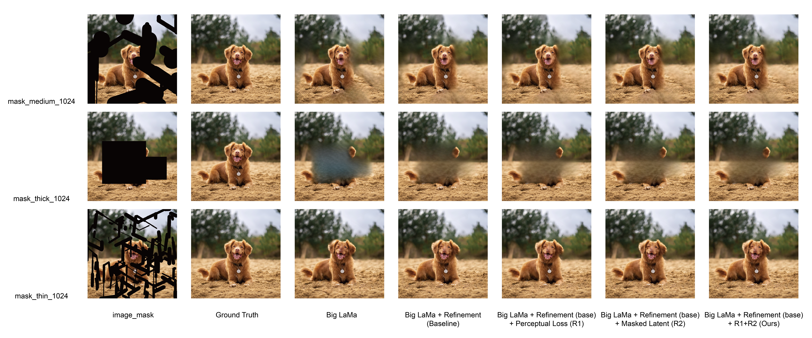
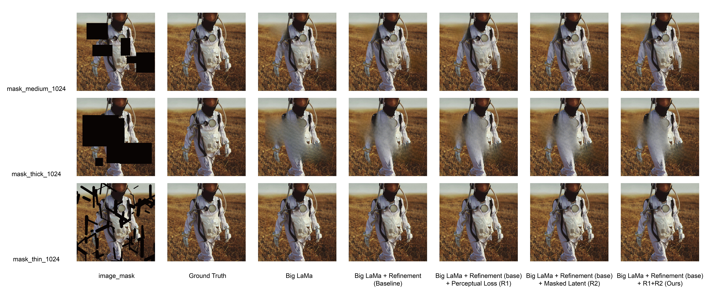

# 11785-Project #30: Perceptual-Guided Masked Latent Refinement for High-Resolution Inpainting

by Yulin Chen, Leo Zhuang, Wendy Wang, Grace Wang





<p align="center">
  <a href="https://colab.research.google.com/github/MaoliYulin/11785-Project/blob/main/colab/lama_refinement_proposed_method.ipynb">
    
  </a>
  <br>
  Try out in Google Colab
</p>


# Colab Run (Highly Recommend)

Colab file is in /11785-Project/colab/

Directly run all cells

# Environment setup

Clone the repo:
`git clone https://github.com/MaoliYulin/11785-Project.git`

1. Python virtualenv:

    ```
    virtualenv inpenv --python=/usr/bin/python3
    source inpenv/bin/activate
    pip install torch==1.8.0 torchvision==0.9.0
    
    cd lama
    pip install -r requirements.txt 
    ```

2. Conda
    
    ```
    % Install conda for Linux, for other OS download miniconda at https://docs.conda.io/en/latest/miniconda.html
    wget https://repo.anaconda.com/miniconda/Miniconda3-latest-Linux-x86_64.sh
    bash Miniconda3-latest-Linux-x86_64.sh -b -p $HOME/miniconda
    $HOME/miniconda/bin/conda init bash

    cd lama
    conda env create -f conda_env.yml
    conda activate lama
    conda install pytorch torchvision torchaudio cudatoolkit=10.2 -c pytorch -y
    pip install pytorch-lightning==1.2.9
    ```

# Inference <a name="prediction"></a>

Run
```
cd 11785-Project
export TORCH_HOME=$(pwd) && export PYTHONPATH=$(pwd)
```

**1. Download pre-trained models**

The Big-LaMa model:
    
```    
curl -LJO https://huggingface.co/smartywu/big-lama/resolve/main/big-lama.zip
unzip big-lama.zip
```

**2. Prepare images and masks**

Download test images (option 1):

```
!pip install -U gdown
!gdown --id 1p3g1XWECRuybw423aKWmToi6YrjZWq3n -O LaMa_test_images.zip
!unzip LaMa_test_images.zip
```

Download test images (option 2):

```
!pip install -U gdown
!gdown --fuzzy "https://drive.google.com/file/d/1vOFcavKS7u3B-pFNWAxXMJyP_voXXDpq/view?usp=drive_link" -O test_images.zip
!unzip test_images.zip
```
- Check the format of the files:
    ```    
    image1_mask001.png
    image1.png
    image2_mask001.png
    image2.png
    ```

**4. Predict with Refinement**

On the host machine:

    python3 bin/predict.py model.path=$(pwd)/big-lama indir=$(pwd)/LaMa_test_images outdir=$(pwd)/output

if you want to change the refinement model, adjust hyperparameter in /11785-Project/configs/prediction/default.yaml

The refinement code file is in /11785-Project/saicinpainting/evaluation/refinement.py
